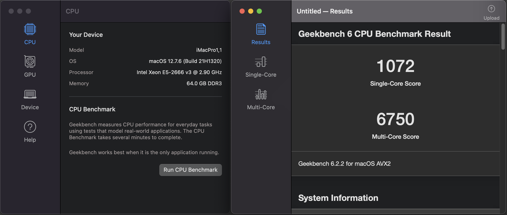

# X99 火神革命 YF3 大板
## 主板简介
- 六项供电直出，带一个散热小风扇
- 四通道DDR3内存
- 带自检灯
- 两个PCIEx16插槽
- 两个NVME插槽
- 一个无线网卡插槽
- 4个USB3.0，4个USB2.0
- PS2键鼠插口
## BIOS
- BIOS比x99D3M4做得好，可以开启休眠和关闭CSM支持
- 开启来电自启
- 开启网络启动
- CSM 关闭
- MSR Lock 关闭
- EHCI USB Hand-Off 开启
- 支持调节内存频率
    - 我将内存频率超频到2133MHZ
## 黑苹果
- 所有功能正常，包括睡眠
- CineBench跑分和Window下一样

